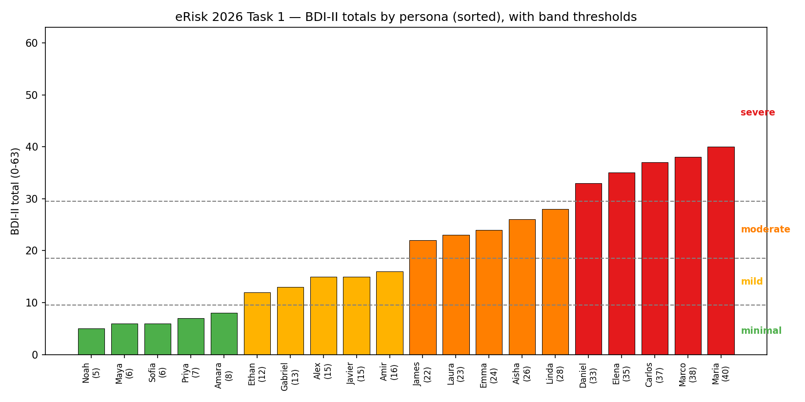
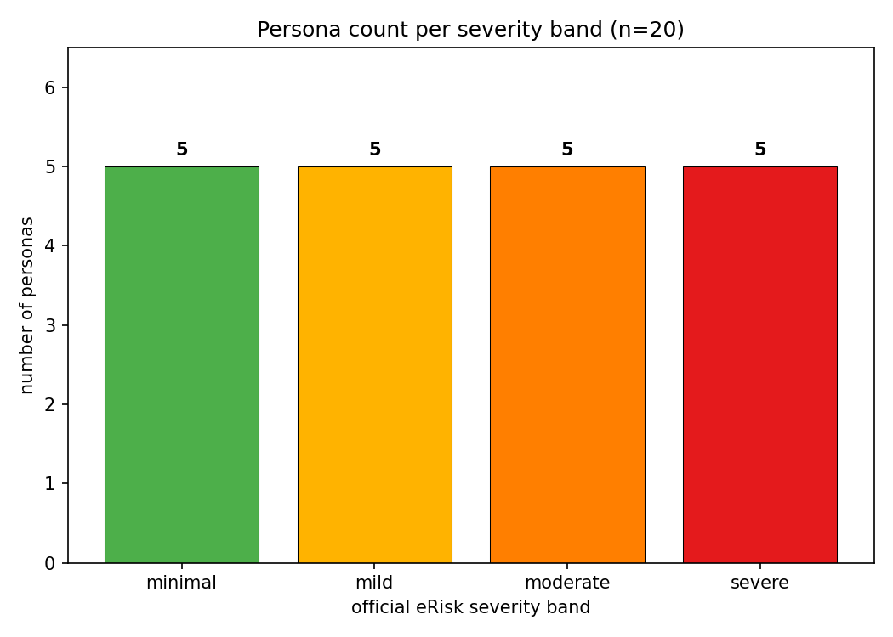
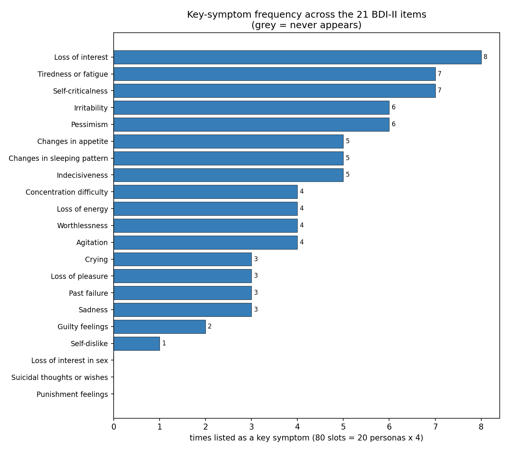
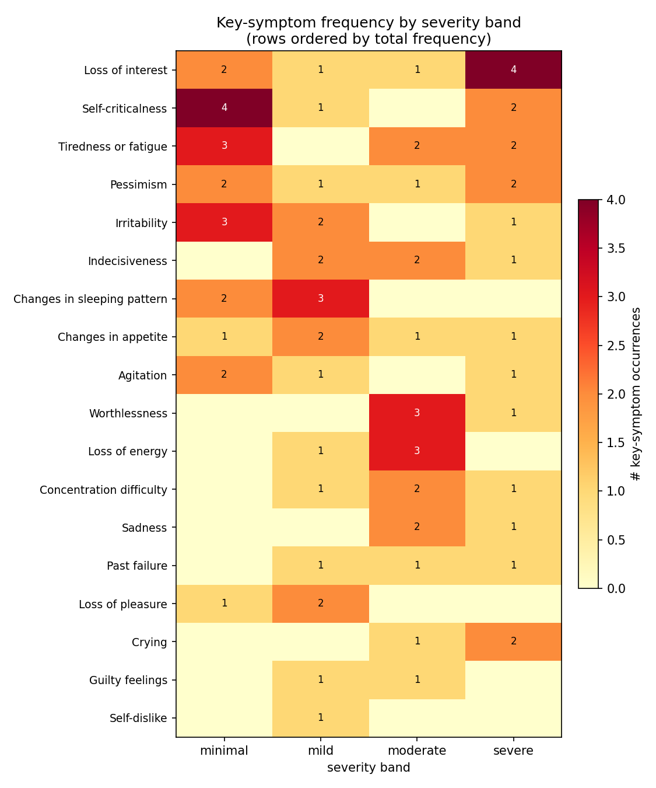
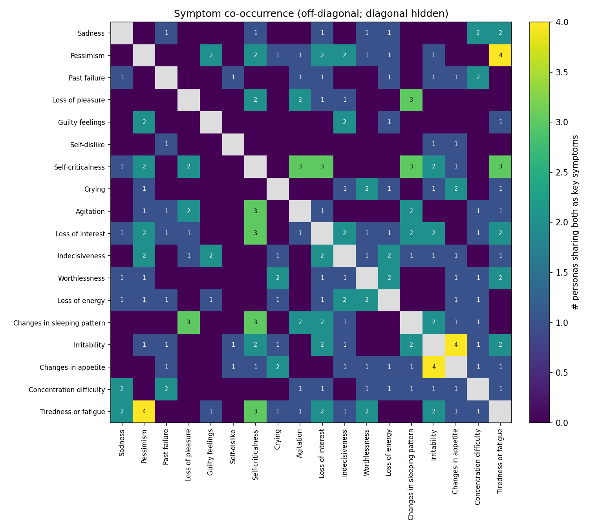

# eRisk 2026 Task 1 — Test Set EDA (INSA-Lyon)

**Scope.** Exploratory data analysis of the eRisk 2026 Task 1 *official test golden data*: 20 LoRA-based LLM personas, each annotated with a BDI-II total (0–63) and a list of 4 "key symptoms". This complements [`task1_results_analysis.md`](task1_results_analysis.md) by characterizing the ground truth our system is scored against.

**Sources.**
- Golden data: [`patients_data.jsonl`](../data/eRisk-2026/eRisk26-datasets-20260519T175618Z-3-001/eRisk26-datasets/task1-llms/golden-data/patients_data.jsonl)
- BDI-II inventory: `bdi_symptoms_list.json` (21 items)
- Symptom synonym map: `symptom_mappings.json`
- All numbers below are produced by [`scripts/eda_task1.py`](../scripts/eda_task1.py) → [`analysis/eda_task1/eda_task1.json`](../analysis/eda_task1/eda_task1.json). Figures in [`analysis/eda_task1/`](../analysis/eda_task1/).

Key symptoms are free text (e.g. "Self-criticism", "Hopelessness") and are normalized to the 21 canonical BDI-II item names via the organizer `symptom_mappings.json` (case-insensitive; for each mapping group the canonical target is the group member matching a BDI item name).

---

## 1. Overview of the test set

| Property | Value |
|---|---:|
| Personas | 20 |
| BDI-II total range | 5 – 40 |
| Mean BDI total | 20.45 |
| Median BDI total | 19.0 |
| Std (sample) | 11.79 |
| Symptom slots | 80 (20 × 4) |
| Distinct BDI items used as key symptoms | 18 / 21 |

The spread is wide (5–40) and the mean (20.45) sits right at the moderate-band floor, so the set is not skewed toward mild cases. Note the test BDI tops out at 40 — there are **no maximal-severity (41–63) personas**, even though three personas exceed 35.

---

## 2. BDI total & band distribution

Official eRisk bands: **minimal 0–9, mild 10–18, moderate 19–29, severe 30–63.**

| Band | Count | Personas (BDI) |
|---|---:|---|
| minimal (0–9) | 5 | Noah (5), Maya (6), Sofia (6), Priya (7), Amara (8) |
| mild (10–18) | 5 | Ethan (12), Gabriel (13), Alex (15), Javier (15), Amir (16) |
| moderate (19–29) | 5 | James (22), Laura (23), Emma (24), Aisha (26), Linda (28) |
| severe (30–63) | 5 | Daniel (33), Elena (35), Carlos (37), Marco (38), Maria (40) |

**Class balance — the headline.** The test set is **perfectly balanced: 5 personas per band.** This is the opposite of a naturally occurring depression sample (which is dominated by minimal/mild) and it is *deliberately hard*: a system cannot win DCHR by leaning on a majority-class prior. Every band carries equal weight, so the 5 severe personas are worth exactly as much as the 5 minimal ones.

> Note: the project brief anticipated a "small severe class." That assumption is **not** borne out by this golden data — the severe band is the same size (5) as every other band. The difficulty is not severe-class *scarcity* but the fact that severe accuracy is heavily penalized in our system (§6), where all 5 severe personas were under-predicted to moderate/mild in every official run.

---

## 3. Key-symptom prevalence

Across the 80 symptom slots, 18 of the 21 BDI-II items appear at least once.

| Symptom | Times listed |
|---|---:|
| Loss of interest | 8 |
| Self-criticalness | 7 |
| Tiredness or fatigue | 7 |
| Irritability | 6 |
| Pessimism | 6 |
| Changes in appetite | 5 |
| Changes in sleeping pattern | 5 |
| Indecisiveness | 5 |
| Worthlessness | 4 |
| Concentration difficulty | 4 |
| Loss of energy | 4 |
| Crying | 3 |
| Sadness | 3 |
| Past failure | 3 |
| Agitation | 3 |
| Loss of pleasure | 3 |
| Guilty feelings | 2 |
| Self-dislike | 1 |

**Never appear as key symptoms (3 items):** `Punishment feelings`, `Suicidal thoughts or wishes`, `Loss of interest in sex`.

- The distribution is dominated by a cognitive/motivational/somatic cluster — **Loss of interest, Self-criticalness, Tiredness or fatigue, Irritability, Pessimism** account for 34/80 slots (43%).
- The absence of `Suicidal thoughts or wishes` is notable for safety modeling: no persona's key-symptom profile is built around suicidality, so a system tuned to flag suicidal ideation gains nothing here. (Daniel lists "Loss of interest" twice, so he has only 3 distinct key symptoms.)

---

## 4. Symptom prevalence by severity band

Counts of each symptom restricted to a band (rows ordered by total frequency in the figure):

**Symptoms most characteristic of the SEVERE band (5 personas):**

| Symptom | Severe count |
|---|---:|
| Loss of interest | 4 |
| Pessimism | 2 |
| Self-criticalness | 2 |
| Crying | 2 |
| Tiredness or fatigue | 2 |

**Symptoms most characteristic of the MINIMAL band (5 personas):**

| Symptom | Minimal count |
|---|---:|
| Self-criticalness | 4 |
| Irritability | 3 |
| Tiredness or fatigue | 3 |
| Pessimism | 2 |
| Agitation | 2 |

**Reading.** Several symptoms appear in *both* extremes (Self-criticalness, Tiredness or fatigue, Pessimism) — they are poor severity discriminators on their own. The cleaner severe markers are **Loss of interest** (4/5 severe personas) and **Crying** (severe-leaning, see §5). The minimal band is characterized by low-grade markers (Self-criticalness, Irritability, Agitation) that the synonym map collapses from descriptions like "Minor Self-Criticism", "Mild Restlessness", "Occasional Irritability".

---

## 5. Mean BDI of personas carrying each symptom

Which symptoms associate with higher overall severity (mean BDI total of the personas who list that symptom):

| Symptom | n personas | Mean BDI | Min–Max |
|---|---:|---:|---:|
| Crying | 3 | 32.7 | 26–37 |
| Sadness | 3 | 29.0 | 24–40 |
| Worthlessness | 4 | 26.5 | 22–35 |
| Past failure | 3 | 25.0 | 13–38 |
| Concentration difficulty | 4 | 25.0 | 15–40 |
| Indecisiveness | 5 | 22.8 | 15–37 |
| Loss of interest | 7 | 22.3 | 6–40 |
| Loss of energy | 4 | 21.8 | 22–26 |
| ... | | | |
| Self-criticalness | 7 | 16.4 | 5–40 |
| Irritability | 6 | 14.0 | 6–37 |
| Self-dislike | 1 | 13.0 | 13–13 |
| Loss of pleasure | 3 | 11.7 | 6–16 |
| Changes in sleeping pattern | 5 | 11.0 | 5–23 |

**Reading.** **Crying (32.7), Sadness (29.0), Worthlessness (26.5)** are the strongest severity signals — personas carrying these average moderate-to-severe. At the bottom, **Changes in sleeping pattern (11.0), Loss of pleasure (11.7), Self-dislike (13.0)** are carried mostly by low-BDI personas. Frequency and severity-association diverge: *Loss of interest* is the single most frequent symptom (8×) but only mid-severity on average (22.3), because it spans the entire range (Sofia 6 → Maria 40).

---

## 6. Symptom co-occurrence

21×21 co-occurrence matrix (off-diagonal = number of personas listing both symptoms; diagonal hidden in the figure).

Top co-occurring key-symptom pairs:

| Symptom A | Symptom B | Personas |
|---|---|---:|
| Irritability | Changes in appetite | 4 |
| Pessimism | Tiredness or fatigue | 4 |
| Loss of pleasure | Changes in sleeping pattern | 3 |
| Self-criticalness | Agitation | 3 |
| Self-criticalness | Changes in sleeping pattern | 3 |
| Self-criticalness | Loss of interest | 3 |

The strongest pairs are modest (max 4 / 20 personas) — the personas were designed with diverse symptom combinations rather than a single recurring archetype. No two symptoms are near-coupled, so a system cannot reliably infer one key symptom from another.

---

## 7. Per-persona table

| pid | Name | BDI | Band | Key symptoms (normalized) |
|---:|---|---:|---|---|
| 1 | Aisha | 26 | moderate | Crying, Worthlessness, Loss of energy, Changes in appetite |
| 2 | Alex | 15 | mild | Concentration difficulty, Irritability, Changes in sleeping pattern, Changes in appetite |
| 3 | Amara | 8 | minimal | Irritability, Tiredness or fatigue, Self-criticalness, Changes in appetite |
| 4 | Amir | 16 | mild | Loss of pleasure, Self-criticalness, Agitation, Changes in sleeping pattern |
| 5 | Carlos | 37 | severe | Indecisiveness, Crying, Changes in appetite, Irritability |
| 6 | Daniel | 33 | severe | Pessimism, Self-criticalness, Loss of interest (×2) |
| 7 | Elena | 35 | severe | Pessimism, Crying, Tiredness or fatigue, Worthlessness |
| 8 | Emma | 24 | moderate | Sadness, Past failure, Loss of energy, Concentration difficulty |
| 9 | Ethan | 12 | mild | Loss of pleasure, Loss of interest, Changes in sleeping pattern, Indecisiveness |
| 10 | Gabriel | 13 | mild | Irritability, Past failure, Changes in appetite, Self-dislike |
| 11 | James | 22 | moderate | Loss of energy, Worthlessness, Loss of interest, Indecisiveness |
| 12 | Javier | 15 | mild | Pessimism, Guilty feelings, Loss of energy, Indecisiveness |
| 13 | Laura | 23 | moderate | Sadness, Worthlessness, Tiredness or fatigue, Concentration difficulty |
| 14 | Linda | 28 | moderate | Guilty feelings, Pessimism, Indecisiveness, Tiredness or fatigue |
| 15 | Marco | 38 | severe | Past failure, Agitation, Loss of interest, Concentration difficulty |
| 16 | Maria | 40 | severe | Sadness, Tiredness or fatigue, Self-criticalness, Loss of interest |
| 17 | Maya | 6 | minimal | Pessimism, Agitation, Self-criticalness, Tiredness or fatigue |
| 18 | Noah | 5 | minimal | Self-criticalness, Loss of interest, Irritability, Changes in sleeping pattern |
| 19 | Priya | 7 | minimal | Agitation, Changes in sleeping pattern, Self-criticalness, Loss of pleasure |
| 20 | Sofia | 6 | minimal | Pessimism, Irritability, Tiredness or fatigue, Loss of interest |

---

## 8. Implications for our system

1. **Balanced bands punish band-collapse.** With exactly 5 personas per band, our DCHR is the average of four equal-weight buckets. The official runs scored 0/5 on the severe band (see [`task1_results_analysis.md`](task1_results_analysis.md) §4: all of Carlos, Daniel, Elena, Marco, Maria predicted moderate/mild) — that single bucket alone caps DCHR at ~0.75 regardless of how well we do elsewhere. **Fixing severe under-prediction is worth a full quarter of the band-accuracy metric.**

2. **The severe band is reachable, not extreme.** Severe golden scores are 33–40, all below the BDI ceiling (63). Our systematic prediction ≤22 for these personas is a ~12–18 point gap, not a saturation problem. Post-hoc corrections that shave the high end (`flat_minus_3`, multiplicative) are actively harmful here and should be band-gated off above ~30.

3. **Loss of interest is the dominant target symptom (8/20)** and the strongest frequency marker of the severe band (4/5). Symptom-detection (ASHR/LASHR) should weight anhedonia/loss-of-interest evidence highly — it is both the most common label and concentrated where we are weakest.

4. **Crying, Sadness, Worthlessness are high-severity flags** (mean BDI 26–33). When an assessor surfaces these, the total estimate should bias upward — useful as a guard against the severe under-prediction in (1).

5. **Three BDI items never appear** (Punishment feelings, Suicidal thoughts or wishes, Loss of interest in sex). Predicting these as key symptoms can only cost ASHR precision; the symptom head can safely down-weight them for this test distribution.

6. **No symptom pair is tightly coupled** (max co-occurrence 4/20), so symptom prediction must be evidence-driven per item rather than template-driven from an archetype.
