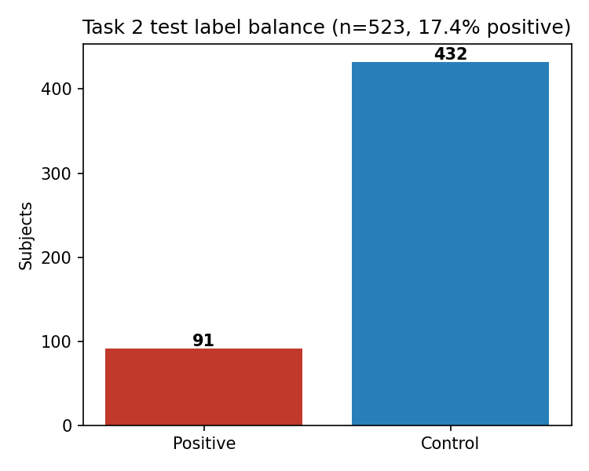
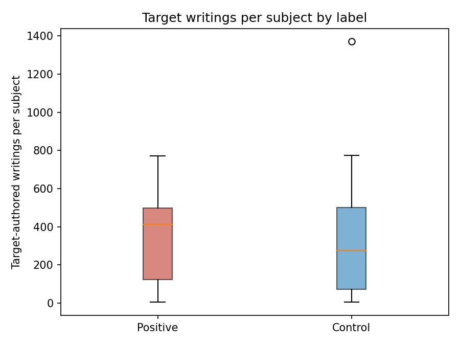
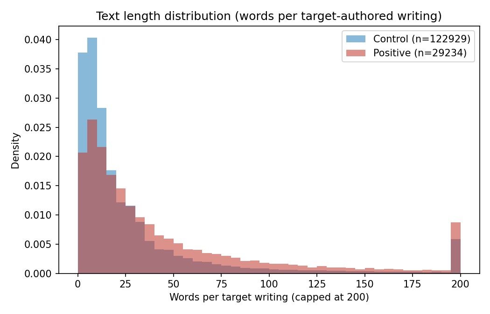
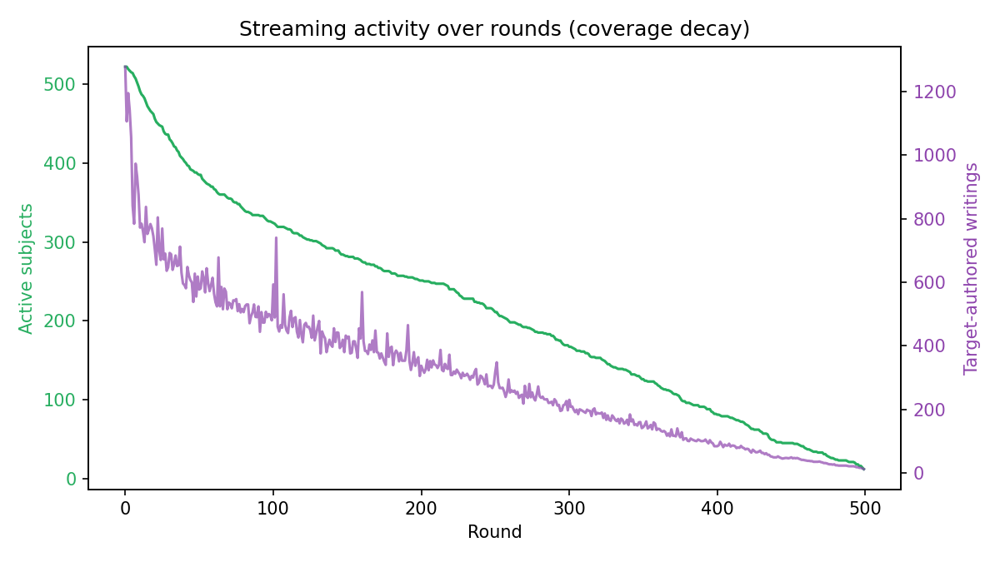
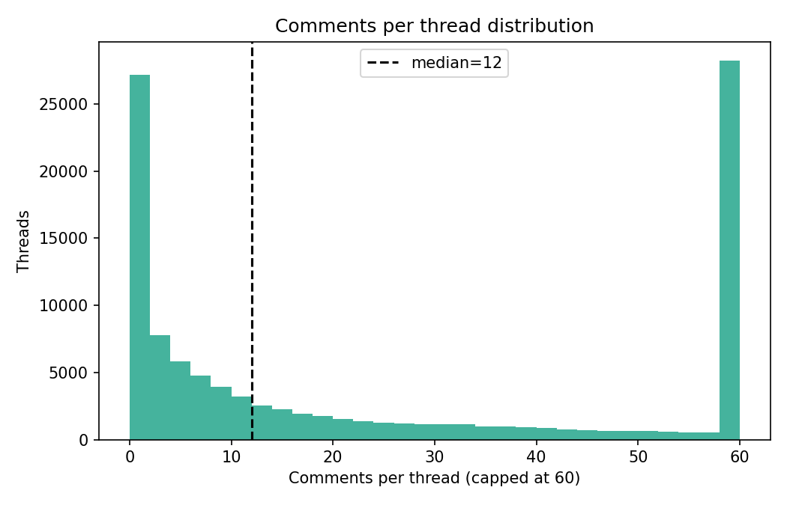
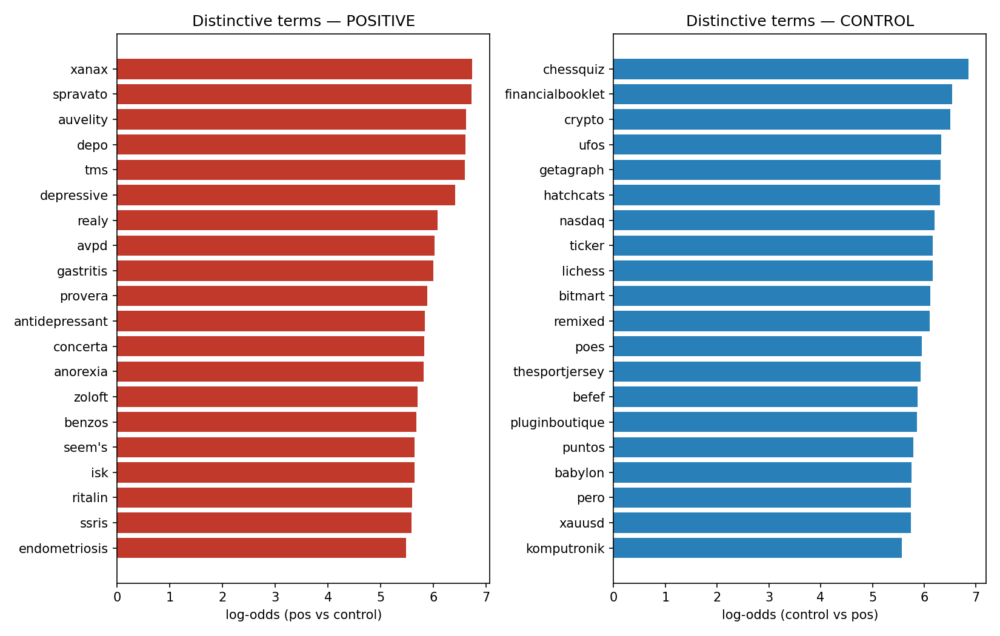

# eRisk 2026 Task 2 — Test-Set EDA (INSA-Lyon)

**Task.** Contextualized early detection of depression: for each of 523 Reddit users, decide whether they are at risk of depression based on streamed discussion threads that carry the *full conversational context* (the target's own posts plus the surrounding posts/comments by other participants), not isolated writings. Decisions can be issued at any round; latency is penalized (ERDE, Flatency).

**Scope of this note.** Exploratory analysis of the **official 2026 test set** — the golden labels plus the 500 released round files that the eRisk server streamed during the campaign. Computed by [`scripts/eda_task2.py`](../scripts/eda_task2.py); all numbers below come from [`analysis/eda_task2/eda_task2.json`](../analysis/eda_task2/eda_task2.json).

Throughout, **POSITIVE** = at-risk-of-depression (label 1), **CONTROL** = label 0.

---

## 0. Data provenance and the folder-name caveat

The streamed threads live in `runs/task2/train/server_responses/round_0000.json … round_0499.json` (500 files, JSON lists of ~522 thread objects each). **Despite the folder being named `train`, these are the 2026 test threads**: the set of `targetSubject` values matches the golden test subject ids.

**Overlap verification:**

| | count |
|---|---:|
| Golden subjects | 523 |
| Distinct `targetSubject` seen across all 500 rounds | 522 |
| Overlap (golden ∩ streamed) | **522** |
| In golden but never streamed | `subject_sOPw3Ku` (label = **1**, positive) |
| Streamed but not in golden | none |

So 522 of the 523 golden subjects appear in the round files, and there are no spurious subjects. The single discrepancy is the **522-vs-523 off-by-one**: `subject_sOPw3Ku` carries a golden label of 1 (positive) but **never receives a released thread in any of the 500 rounds**. All per-subject activity statistics below are therefore computed over 522 subjects (**90 positives + 432 controls**); the 91st positive contributes only to the label-balance count, not to the activity distributions.

---

## 1. Test-set overview and label imbalance

| | Subjects | Share |
|---|---:|---:|
| Positive (depression) | 91 | **17.4%** |
| Control | 432 | 82.6% |
| **Total** | **523** | 100% |

The test set is **strongly class-imbalanced (≈1:4.7)**. This is the structural fact behind the precision/recall trade-off we observed in our submitted runs: a classifier that simply chases recall pays heavily in precision because controls outnumber positives almost five to one. Our Run 2 (NN, recall-extreme) is the textbook illustration — it raised 188 alerts to catch 86/91 positives, but 102 of those alerts were false positives (more FPs than there are positives in total). Our best-F1 runs (R0/R4, XGBoost, F1=0.80) accept ~14 missed positives to keep precision at 0.76. **Any single operating point on this set is a position on that imbalance-driven frontier.**

---

## 2. Per-subject activity — positives vs controls

Per subject we separate the target's *own* writings (submissions + comments where `author == targetSubject`) from *context* (everything authored by other Reddit participants in the target's threads). Note that a thread's submission `author` is frequently **not** the target — in round 0, 297/522 submissions are authored by someone other than the target, and the target participates through comments. Context volume is therefore large by design.

**Target-authored writings per subject** (submissions + comments by the target):

| | n | min | median | mean | max | std |
|---|---:|---:|---:|---:|---:|---:|
| Positive | 90 | 4 | **412** | 326 | 771 | 198 |
| Control | 432 | 4 | **276** | 288 | 1370 | 212 |

**Positives are more prolific authors.** Their median target-authored writing count (412) is ~1.5× the control median (276), and the gap is driven by comments: positives have a median of **356** target-authored comments vs **116** for controls, while their submission counts are actually *lower* (median 11.5 vs 28.5). In other words, **positive users engage conversationally (commenting in threads) far more than controls, who skew toward link/submission posting.** This matches the qualitative read of the vocabulary in §5 below (controls' top tokens are dominated by URL/finance/news boilerplate).

**Threads and context** (median values):

| metric | Positive | Control |
|---|---:|---:|
| Threads where subject is the target | 225 | 171 |
| Target submissions | 11.5 | 28.5 |
| Target comments | **356** | 116 |
| Context comments (by others) | **13,707** | 2,598 |
| Distinct context contributors | 11,210 | 2,434 |
| Total span (days, first→last post) | **1,300** | 353 |

Positive threads are *much* denser with context: a median of ~13.7k context comments per positive subject vs ~2.6k per control (a 5× difference), from ~11k distinct contributors vs ~2.4k. **The conversational context is a substantial part of the signal in this task** — positives are embedded in larger, busier discussions, which is exactly what the "contextualized" framing is meant to exploit. (Counts in the tens of thousands are cumulative across all of a subject's threads over the 500 rounds, not per-thread.)

---

## 3. Text characteristics

**Per target-authored writing** (each submission or comment by the target is one observation):

| | n writings | words median | words mean | chars median | chars mean |
|---|---:|---:|---:|---:|---:|
| Positive | 29,234 | **25** | 50.3 | 130 | 267 |
| Control | 122,929 | **13** | 36.8 | 75 | 221 |

**Positive writings are roughly twice as long at the median** (25 vs 13 words; 130 vs 75 characters). Both distributions are heavily right-skewed (a long tail of very long posts up to thousands of words), but positives sit consistently to the right. Combined with §2, the picture is: positives write **more posts** and **longer posts**, and those posts are conversational comments rather than link drops. The longer, denser self-text per positive is favorable for transformer-based symptom scoring (our 1920-d sentence-transformer ensemble + BDI-II features have more signal to work with per positive).

---

## 4. Temporal and streaming dynamics

**Date range.** Posts span **2011-03-06 → 2025-12-05** (~5,388 days of history), i.e. the threads contain long historical Reddit trajectories, not just recent activity. Per-subject active span (first→last post):

| | median span | mean span |
|---|---:|---:|
| Positive | **1,300 days** | 1,450 days |
| Control | 353 days | 750 days |

Positive subjects have a **~3.7× longer active history at the median** — again consistent with them being heavier, longer-tenured Reddit participants.

**Coverage decay across rounds.**

- Round 0 releases threads for **522 subjects**; this falls monotonically to **12** by round 499.
- The decay is gradual: ~324 subjects still active at round 100, ~251 at round 200, ~167 at round 300, ~81 at round 400. Roughly **half the subjects have exhausted their thread supply by ~round 175**.
- Total target-authored writings per round starts at ~1,278 and tapers to ~12, tracking the active-subject curve.

**Implication for latency (ERDE / Flatency).** Because subjects drop out of the stream at very different rates, the *number of rounds available* per subject is itself informative and highly variable. Subjects with short streams force an early decision whether we want one or not. Our Run 1 (ERDE-oriented) alerted at a median latencyTP of ~8–9 writings — well inside the window where the vast majority of subjects are still active (522→~440 over the first ~30 rounds), so early alerting is feasible for almost all true positives. The flip side: a system that waits for long trajectories will simply never see one for the ~half of subjects who exit before round 175, and for `subject_sOPw3Ku` who never streams at all.

---

## 5. Comments per thread and thread depth

Across all 106,819 thread instances:

| metric | median | mean | max |
|---|---:|---:|---:|
| Comments per thread | 12 | 48.4 | 5,093 |
| Distinct context contributors per thread (depth) | 10 | 43.8 | 4,967 |

The distribution is extremely long-tailed: the median thread has 12 comments but a handful have thousands. Each thread is genuinely a *conversation* (median ~10 distinct other participants), which is the defining feature of this task versus a flat post-stream. The context volume confirms that the thread formatter's priority-based truncation (2000-token cap, `[TARGET]` tagging) is doing real work — most threads vastly exceed the token budget and the target's own contributions must be surfaced out of a sea of context.

---

## 6. Vocabulary and linguistic signal

**Most distinctive terms for positives** (log-odds of relative frequency, pos vs control, +0.5 smoothing, min 10 occurrences):

The positive-distinctive list is **dominated by clinical / psychiatric medication and condition terms**, almost none of which appear in control text:

- **Antidepressants & psych meds:** `spravato`, `auvelity`, `antidepressant`, `zoloft`, `lexapro`, `ssris`, `xanax`, `benzos`, `concerta`, `ritalin`.
- **Treatments / conditions:** `tms` (transcranial magnetic stimulation), `depressive`, `depression` (also a top raw token for positives, 1,300 occurrences), `avpd` (avoidant personality disorder), `anorexia`, `limerent`.
- **Comorbid somatic terms:** `gastritis`, `endometriosis`, `pancreas`, `laparoscopic`, `miralax`, `thinners` (blood thinners) — positives discuss physical-health and treatment topics far more.

By contrast, **control-distinctive terms are overwhelmingly topical/boilerplate**: `crypto`, `nasdaq`, `ticker`, `bitmart`, `xauusd`, `lichess`/`chessquiz`, `ufos`, plus URL fragments (`https`, `com`, `www`, `reddit`, `permalink`). Controls cluster around finance, gaming, news aggregation and link-sharing — not personal/clinical discourse.

**Cheap linguistic proxies** (rate per token over all target tokens):

| signal | Positive | Control | ratio |
|---|---:|---:|---:|
| First-person pronoun rate | **5.76%** | 2.57% | 2.2× |
| Negative-emotion lexicon rate | **0.72%** | 0.24% | 2.9× |

Positives use first-person pronouns at ~2.2× the control rate and negative-emotion words at ~2.9×. This is a strong, almost-free signal: **positives write self-referential, affect-laden text**, controls write outward-facing/topical text. It corroborates the medication-vocabulary finding and validates the lexical/VADER layers of our feature stack.

---

## 7. Implications for our system

1. **Class imbalance (17.4% positive) is the dominant constraint.** Every run is a point on a precision/recall frontier set by the ~1:4.7 ratio. Our best-F1 runs (R0/R4, F1=0.80) prioritize precision; Run 2 (NN) shows the cost of recall-chasing (102 FP > 91 total positives). Future work should target the *frontier shape* (e.g. cost-sensitive thresholds) rather than a single metric.

2. **Positives are more active and write longer, more self-referential text.** Median target writings 412 vs 276, median words/writing 25 vs 13, first-person rate 2.2× and negative-emotion rate 2.9× higher. The signal we rely on (transformer symptom scores, lexical/VADER/emotion features) is genuinely *present and stronger* in positives — supporting the +0.10/+0.12 train→test F1 lift we saw on XGBoost/Ensemble (longer trajectories help).

3. **Context is voluminous and central.** Positives sit in 5× larger discussions (median 13.7k vs 2.6k context comments). The "contextualized" framing is real; the thread formatter's truncation/`[TARGET]` tagging is load-bearing. There may be additional signal in *context* features (who replies, thread density) that we currently mostly discard.

4. **Streaming decay supports early alerting.** Coverage falls 522→12 over 500 rounds, ~half gone by round 175. Run 1's median alert at ~8–9 writings is comfortably inside the high-coverage window, so the ERDE-oriented run loses little reach by alerting early — and gains on latency-weighted metrics. A system that waits for long trajectories forfeits the ~half of subjects who exit early.

5. **The 91st positive (`subject_sOPw3Ku`) never streams.** It is a guaranteed miss for any decision system (no data to score). When reconciling our local re-scoring against the official numbers, this off-by-one should be kept in mind (it is in the golden denominator of 91 positives but cannot be alerted on). Worth confirming whether the organizers scored it as an automatic FN.

6. **The medication/condition vocabulary is a high-precision lexical anchor.** Terms like `spravato`, `auvelity`, `tms`, `ssris`, `concerta` appear almost exclusively in positives. A targeted clinical-term feature (or boosting these in the BDI-II/lexical layer) could improve early precision cheaply, especially for ERDE5 where early high-precision alerts are rewarded.

---

*Figures and raw statistics: [`analysis/eda_task2/`](../analysis/eda_task2/). Regenerate with `python scripts/eda_task2.py` (streams the 500 round files; no full-corpus memory load).*
