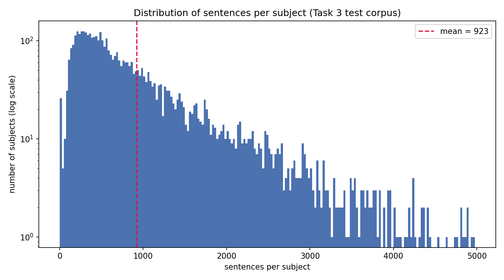
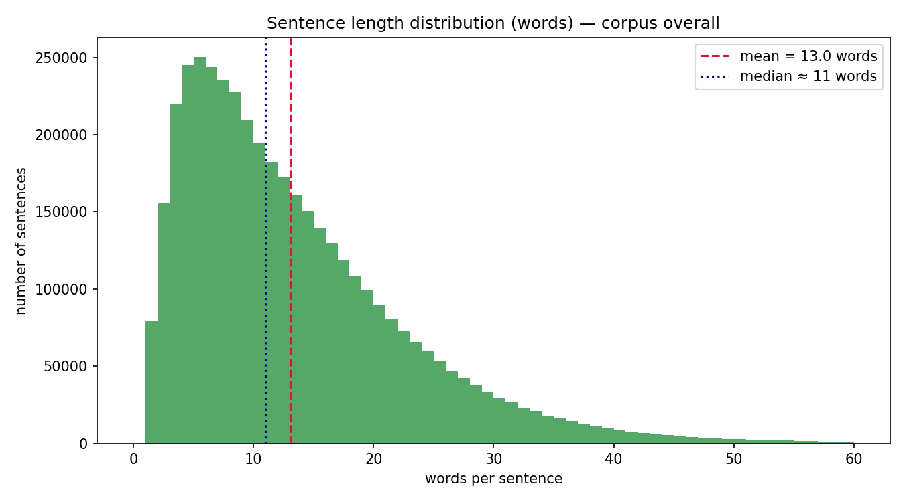
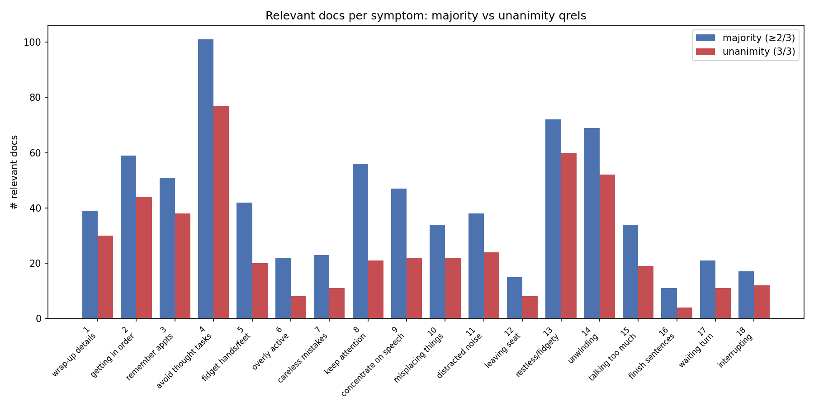
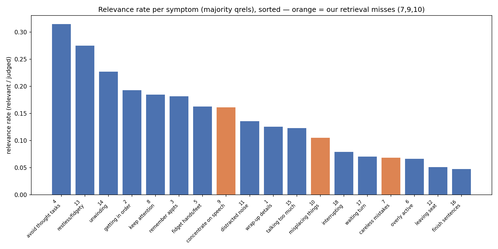
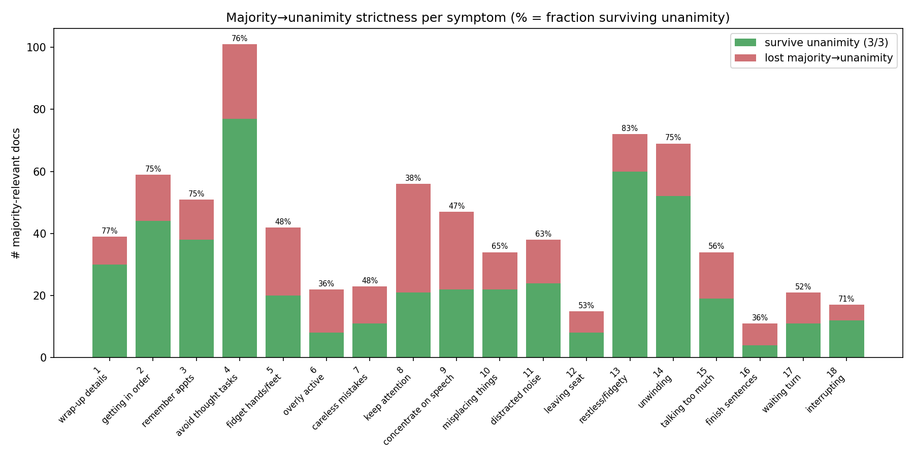
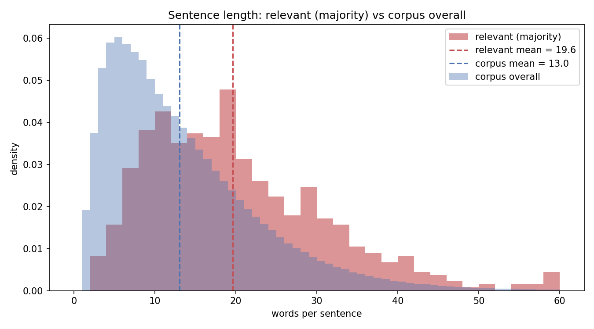

# eRisk 2026 Task 3 — Test-Set EDA (INSA-Lyon)

**Task.** ADHD symptom sentence ranking (1st edition). For each of 18 Adult ADHD Self-Report Scale (ASRS-v1.1) symptoms, rank up to 1000 candidate sentences from a multi-million-sentence corpus by their relevance to the symptom. Relevance was pooled from all teams' top-k and judged by 3 expert annotators, yielding two qrels: **majority** (≥2/3 agree) and **unanimity** (3/3 agree).

This document is the exploratory data analysis of the **official test set** (corpus + golden qrels), complementing the results analysis in [`task3_results_analysis.md`](task3_results_analysis.md). All numbers are generated by [`scripts/eda_task3.py`](../scripts/eda_task3.py) and stored in [`analysis/eda_task3/eda_task3.json`](../analysis/eda_task3/eda_task3.json). The corpus was streamed one `.trec` file at a time (constant memory; full 4521-file pass in ~40 s, no sampling).

---

## 1. Corpus overview

| Quantity | Value |
|---|---:|
| Subjects (`.trec` files) | **4,521** |
| Total sentences (`<DOC>` blocks) | **4,170,875** (≈ 4.17 M) |
| Empty `<TEXT>` sentences | 0 |
| Malformed `<DOC>` blocks | 0 |
| Total posts (subject × postIndex groups) | 1,466,392 |

The corpus size matches the specification's "≈4.17M sentences" exactly: **4,170,875**. Every `<DOC>` block parsed cleanly — no empty TEXT, no malformed blocks. DOCNO follows `{subjectcode}_{postIndex}_{sentenceIndex}`; PRE/POST context windows are usually empty and were captured but not analysed (the unit of judgement is the TEXT sentence).

### Per-subject / per-post structure

| Distribution | min | max | mean | median≈ | std |
|---|---:|---:|---:|---:|---:|
| Sentences per subject | 0 | 26,272 | **922.6** | 600 | 998.5 |
| Posts per subject | 0 | 1,347 | 324.4 | 250 | 237.8 |
| Sentences per post | 1 | 1,176 | 2.84 | 2 | 4.63 |

Subjects are highly heterogeneous: the median user contributes ~600 sentences but the distribution is long-tailed (max 26k sentences, std > mean). A post yields ~3 sentences on average — these are short Reddit-style posts split into sentences.



## 2. Sentence / length statistics

| Distribution | min | max | mean | median≈ | std |
|---|---:|---:|---:|---:|---:|
| Words per sentence | 1 | 3,976 | **13.0** | 11 | 12.0 |
| Chars per sentence | 3 | 38,547 | 71.5 | 55 | 70.1 |

The typical corpus sentence is short — about **13 words / 55–71 characters** — consistent with conversational social-media text. The extreme maxima (a 3,976-word "sentence") are sentence-splitter artefacts (un-split blocks of text), but they are rare enough not to move the mean materially.



## 3. Qrels relevance distribution per symptom

Both qrels judge the **same 5,224 pooled assessments** over **4,362 unique doc_ids** (a doc can be pooled for more than one symptom). Totals:

| Qrels | Judged | Relevant | Overall relevance rate |
|---|---:|---:|---:|
| Majority (≥2/3) | 5,224 | **751** | 14.4% |
| Unanimity (3/3) | 5,224 | **483** | 9.2% |

### Per-symptom (majority qrels)

| sid | ASRS symptom | judged | relevant | rel. rate |
|---:|---|---:|---:|---:|
| 1 | Trouble wrapping up final details | 311 | 39 | 0.125 |
| 2 | Difficulty getting things in order | 306 | 59 | 0.193 |
| 3 | Problems remembering appointments | 281 | 51 | 0.181 |
| 4 | Avoiding/delaying tasks requiring thought | 321 | **101** | **0.315** |
| 5 | Fidgeting hands/feet | 258 | 42 | 0.163 |
| 6 | Feeling overly active/compelled | 331 | 22 | 0.066 |
| 7 | Careless mistakes on boring/difficult work | 337 | 23 | 0.068 |
| 8 | Difficulty keeping attention | 303 | 56 | 0.185 |
| 9 | Difficulty concentrating on what people say | 292 | 47 | 0.161 |
| 10 | Misplacing/finding things | 323 | 34 | 0.105 |
| 11 | Distracted by activity/noise | 280 | 38 | 0.136 |
| 12 | Leaving seat when seated expected | 294 | **15** | **0.051** |
| 13 | Feeling restless/fidgety | 262 | 72 | 0.275 |
| 14 | Difficulty unwinding/relaxing | 304 | 69 | 0.227 |
| 15 | Talking too much | 277 | 34 | 0.123 |
| 16 | Finishing others' sentences | 231 | **11** | **0.048** |
| 17 | Difficulty waiting your turn | 298 | 21 | 0.070 |
| 18 | Interrupting others | 215 | 17 | 0.079 |

**Highlights (majority):**
- **Most relevant docs:** sid 4 *avoiding tasks requiring thought* (101), sid 13 *restless/fidgety* (72), sid 14 *difficulty unwinding* (69). These are the hardest **recall** targets — a system must surface many true sentences to score well.
- **Fewest relevant docs:** sid 16 *finishing others' sentences* (11), sid 12 *leaving seat* (15), sid 18 *interrupting* (17). Tiny pools → AP is volatile and a single hit moves the score a lot.
- **Highest relevance rate** (relevant / judged): sid 4 (0.315), sid 13 (0.275), sid 14 (0.227) — the pooling for these symptoms surfaced cleaner candidate sets.
- **Lowest relevance rate:** sid 16 (0.048), sid 12 (0.051), sid 6 (0.066) — pools dominated by false positives; hard precision targets.

Judged-pool sizes are fairly even (215–337 per symptom), so relevance-rate differences are genuine signal about symptom difficulty, not a pooling-depth artefact.





## 4. Majority vs unanimity strictness

Tightening from majority (≥2/3) to unanimity (3/3) drops the relevant set from **751 → 483**, an **overall shrinkage ratio of 0.643** — i.e. roughly **36% of majority-relevant sentences lose a vote** when all three annotators must agree.

The shrinkage is strongly symptom-dependent (per-symptom survive ratio = unanimity-relevant / majority-relevant):

| Bucket | Symptoms | survive ratio |
|---|---|---:|
| High agreement (≥ 0.75) | 13 *restless* (0.83), 1 *wrap-up* (0.77), 4 *avoid thought* (0.76), 14 *unwinding* (0.75), 2 *getting in order* (0.75), 3 *remember appts* (0.75) | 0.75–0.83 |
| Low agreement (≤ 0.48) | 8 *keep attention* (0.38), 6 *overly active* (0.36), 16 *finish sentences* (0.36), 9 *concentrate on speech* (0.47), 5 *fidget hands* (0.48), 7 *careless mistakes* (0.48) | 0.36–0.48 |

**Interpretation.** Annotators agree most on concrete, emotionally salient states (restlessness, can't-unwind, avoidance). They disagree most on inattention-cluster items (8, 9, 7) and on subtle impulsivity (16 *finishing sentences*, 6 *overly active*) — symptoms whose textual evidence is ambiguous and context-dependent. This is direct evidence that **the inattention symptoms are intrinsically harder to label**, which dovetails with our system's struggles on the same items (§6).



## 5. Relevant-sentence text characteristics

Comparing word-length of relevant (majority) sentences against all judged sentences and the corpus at large:

| Group | n | mean words | median | std |
|---|---:|---:|---:|---:|
| Relevant (majority) | 670 unique | **19.6** | 18 | 11.4 |
| All judged (pooled) | 4,362 | 17.3 | 15 | 12.1 |
| Corpus overall | 4,170,875 | **13.0** | 11 | 12.0 |

(The 751 majority-relevant *assessments* map to **670 unique sentences** — some sentences are relevant to more than one symptom; all 670 were located in the corpus, 0 missing.)

**Relevant ADHD-evidence sentences are noticeably longer than the corpus norm: ~19.6 vs ~13.0 words (median 18 vs 11)**. The pooled-judged set sits in between (17.3). The interpretation is that genuine symptom evidence tends to be a fuller self-disclosure ("I always lose my keys and forget where I parked the car") rather than a terse fragment, and the pooling stage already skews candidates longer than random corpus sentences. Practical consequence: **a length prior favouring slightly longer sentences is mildly informative**, but it is weak (the distributions overlap heavily) and should never be a hard filter — plenty of relevant sentences are short.



## 6. Implications for our system

Cross-referencing the relevance distribution above with our runs' per-symptom AP (see [`task3_results_analysis.md`](task3_results_analysis.md) §4–5):

1. **The retrieval miss on symptoms 7, 9, 10 is even more costly than it looked.** These three symptoms hold **23 + 47 + 34 = 104 majority-relevant docs = 13.9% of all 751 relevant docs**, yet our five runs retrieved **zero** of them in their top-1000. They are mid-sized pools (not tiny), so this is squarely a candidate-coverage failure, not a small-pool fluke. Recovering even partial recall here is the single biggest lever to close the gap to the leader.

2. **The hardest recall targets are the big pools — sid 4, 13, 14.** sid 4 *avoiding tasks requiring thought* (101 relevant) and sid 14 *difficulty unwinding* (69) are large but our AP on them is weak (BiEnc 0.221 on sid 4; all systems < 0.02 on sid 14). sid 14 combines a large pool with low system AP — a high-value, currently-unsolved symptom. sid 13 *restless/fidgety* (72) is the bright spot: large pool **and** high annotator agreement (0.83) **and** decent AP (BiEnc 0.264) — a symptom where the signal is clean end-to-end.

3. **Annotator-disagreement and system-difficulty coincide on the inattention cluster.** Symptoms 7, 8, 9 have the lowest unanimity-survival (0.38–0.48) *and* are where our systems score lowest. The ambiguity that makes annotators disagree is the same ambiguity that defeats retrieval and ranking. For these, query reformulation (idiomatic paraphrases of "zoned out", "lost track of what they were saying") is more promising than more training.

4. **Small-pool impulsivity items (12, 16, 18) are AP-volatile.** With 11–17 relevant docs, a single well-placed hit swings AP heavily — which is exactly why LLM_cascade and HiPerT_full post their highest per-symptom AP here (sid 16, 18) despite the tiny pools. These are precision plays, not recall plays.

5. **A weak length prior is available but low-value.** Relevant sentences average ~6.6 more words than the corpus mean. This could feed a soft feature, but the heavy overlap means it cannot substitute for semantic matching and must not become a hard length cutoff (relevant sentences range from 2 to 74 words).

---

### Reproducing this analysis

```bash
unset VIRTUAL_ENV
uv run python scripts/eda_task3.py
```

Outputs `analysis/eda_task3/eda_task3.json` and six PNGs. The corpus pass streams all 4,521 files in constant memory (~40 s); set `CORPUS_FILE_SAMPLE = N` at the top of the script to subsample for a faster smoke test (recorded in the JSON `meta`).
